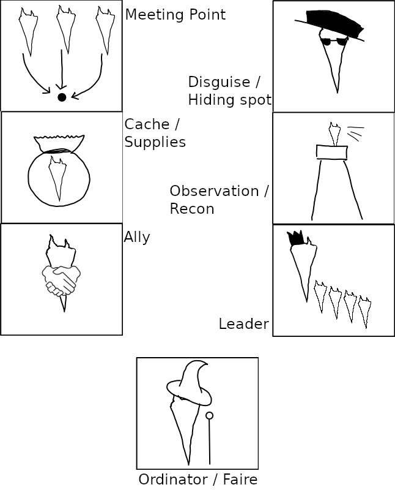

# Appendix: Custom Items

## Magic Items

A quick reference for the custom magic items that are referenced in the adventure.

- [Confining Collar](../items/confining-collar.md)
- [Jury-Rigged Wand](../items/jury-rigged-wand.md)
- [Networked Earrings of Message](../items/networked-earrings-of-message.md)
- [Potion of Animating](../items/potion-of-animating.md)
- [Potion of Corporeal Resetting](../items/potion-of-corporeal-resetting.md)
- [Potion of Lesser Invisibility](../items/potion-of-lesser-invisibility.md)
- [Ring of Seeking](../items/ring-of-seeking.md)

## Mundane Items

Particular notes or clues that have explicit text on them, that the party may find during the adventure.

- [Carlton's Letter to Groubun](../items/carltons-letter-to-groubun.md)

## Other Notable Items or Scenery

### Gang Symbols

The Piranhas' gang has a set of covert glyphs and markings that they leave around Halfyord, to convey information to each other that goes unnoticed by the general public and the guards.
The party may encounter these symbols during their reconnaissance of the docks, or notice them during the day when the gang takes action.
There is also a board with a key to the symbols pinned up in the Piranhas' hideout; the relevant markings are shown in the image below.

Note that as per the description in the [relevant scene](../scenes/07-infiltrating-the-hideout.md), the symbol for Faire or Ordinator has been drawn onto the board recently.
