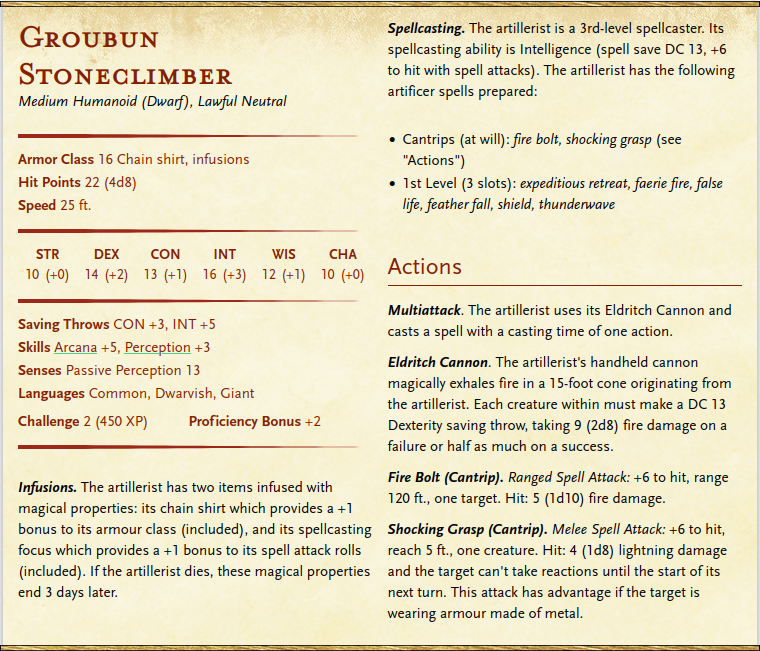

# Groubun Stoneclimber

## Backstory

Faire Ron-Ron's ambitious and resentful apprentice.
Groubun has a natural aptitude for imbuing mundane objects with magical properties, and has contributed to a number of advancements in the fields of alchemy and artifice.
After joining the Ordo through as an apprentice, Groubun chose to study under Faire Ron-Ron due to his long-standing reputation as a pioneer in magical research.
Of course, Groubun quickly came to realise that Faire had since lost the skills that his reputation afforded him.

Groubun has been the brains behind most of Faire's recent contributions to magical advancement, however Faire's association as his supervisor and reputation in the wider community mean that Groubun's name is often overlooked.
With Faire's "promotion" to Ordinator in Halfyord, Groubun essentially saw his career progression chances tank as he knew he'd be following Faire to the post.
Groubun has also witnessed Faire's incompetence in his role as Ordinator, continuing to head up futile experiments and shove his Ordinator duties onto Groubun and Jenessa.
This his gradually built up over the past 2 years into resentment, and more recently opportunity.

## Appearance & Personality

Groubun is a mountain dwarf, standing around 4 foot 6 with a solid-built frame.
He sports a long, black beard that reaches down his neck and is braided at the tip, but is otherwise bald.
His eyes are a cold blue, deep set into an almost chubby face.

Normally Groubun wears a set of artificer's goggles on his head, over his eyes, or around his neck - even when not working.
His attire includes practical clothes that have few trailing straps or pieces of cloth, sporting a belt with a wide range of tools attached at the waist alongside a pair of thick welding gloves.

He speaks with in a gruff tone, in a very precise manner.
His tone is not dismissive or derogatory, and he can be very open around people he knows or when intoxicated.

Groubun gets annoyed when people say they understand a concept but later fail to demonstrate "common knowledge" about it, but will attempt to help them understand should they ask.
Conversely, he enjoys it when people are upfront about not knowing anything about something actively ask him about something he knows a lot about.
He enjoys discussing research ideas, and has an aptitude for running the Ordo despite the appearance he puts up of it taking a toll on his work.

## Relations

Groubun gets along well with Jenessa, though it is his more recent elevation to acting Ordinator that has helped this somewhat as he's now doing the aspects of Faire's job that Jenessa was picking up.

To Faire, Groubun keeps up the illusion of an enthusiastic student but has begun to withhold information about his latest experiments and the like.
Of course, Groubun secretly resents his position as Faire's apprentice.

He isn't sure what to make of Fordem given that he was introduced to the gang through the charlatan bartender - he was friendly with Fordem prior to this introduction, but now he views their relationship as very much transactional. The two still put on a convincing display when he arrives at the Day's Rest with information or supplies though.

Carlton is very much a means to an end, entirely a business relationship.
Part of Groubun cannot wait for their arrangement to end.

## Stat Block

