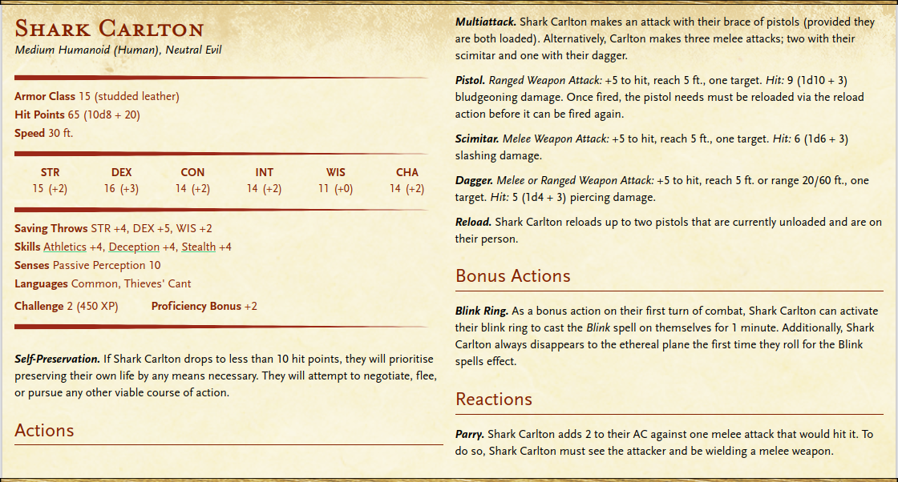

# Shark Carlton

## Backstory

Leader of the Shattered Teeth through their combination of cunning, guile, and ruthlessness.
Ever since the gang came under hard times due to the diligence of Shufharz, Shark Carlton has not enjoyed the luxuries that their life of crime once afforded them.
Forced into de-facto house arrest within the Shattered Teeth's hideout, they have meticulously been planning a return to the life they formerly enjoyed.

Carlton was a street urchin growing up, and quickly fell into circles that lead them to a rather successful life of crime.
Their affiliation with the Shattered Teeth gang begun shortly after their 17th birthday, when Carlton unknowingly attempted to pickpocket a high-ranking member of the gang who rather graciously saw potential rather than lashing out.
Carlton has since risen through the ranks over the course of 10 years, taking the gang to its all time high through their natural aptitude and ruthless streak.

## Appearance & Personality

Carlton is just under 6 foot tall, and wears a golden tooth necklace - similar to the silver equivalents worn by lower-ranking members of the Shattered Teeth - at all times.
Their face has an old, long scar down one cheek, and their jaw is quite pointed.
Long black hair is often tied up into a ponytail, and adorned with a tricorn hat with a feather coming out of it.
Their eyes offer an intense, piercing stare.

Their clothes are practical civilian garbs often worn by dock workers or sailors, covered by leathers that serve as armour - despite being under house arrest, Carlton continues to dress as if ready to spring into action.
They have a dagger hidden in the sole of their boots, and a scimitar sheathed around their waist.
On their belt is a pouch of musket pellets, and on their hips two flintlock pistols are holstered.

They speak to gang members and subordinates with authority, conviction, and precision.
Carlton typically adopts a sarcastic - almost derogatory - tone that is laced with a sense of urgency or boredom, asking "what can I get out of this interaction".

Carlton values the luxuries of life and the thrill that comes from orchestrating the crimes that support it.
They see crime as the easiest method of sustaining such a lifestyle.
However, above all else Carlton values self-preservation and survival - even to the point of betrayal.

## Relations

Carlton sees Fordem as the closest thing to a friend that a criminal gang can foster.
They despise Shufharz but are indifferent towards Kamonas.
Groubun is more of a useful accomplice than a friend, though Carlton won't hesitate to throw them under the bus in self-preservation.

## Stat Block

