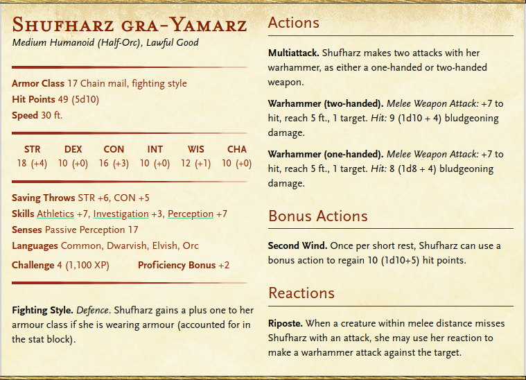

# Shufharz gra-Yamarz

## Backstory

Shufharz has been a career soldier all her life.
Born into a poor household with nothing to their name, Shufharz quickly learnt that to get anywhere requires a lot of determination and effort.
She started working in her early teens, joining her father in the mines and putting her Orcish heritage to good use.
At 18, she enlisted with the local garrison with the support of her parents, all of them hoping it would be a chance for her to advance out of the social status she was born into.

Shufharz showed great martial prowess during her military training, and her no-nonsense attitude towards putting effort in to overcome obstacles did not go unnoticed by her superiors.
After some routine postings in the local garrisons, she was promoted into the standing army as a footsoldier, and later rose to an officer rank, serving in the standing military until her late twenties.
It was during the final years of her twenties that she was assigned as a personal guard to Milena Kamonas, an important governor to the local lord.
Kamonas appreciated Shufharz' no-nonsense attitude but also willingness to challenge authority when there was reason to, and in turn Shufharz appeciated that Kamonas understood that Shufharz' advice was far better than their own in certain contexts.
When Kamonas was assigned as governor of Halfyord, Shufharz was made captain of the guard and has served in that post ever since.

Shufharz is the brains behind the recent decline in the Piranhas's activities, after a methodical campaign lasting just under a year.

## Appearance & Personality

Shufharz is a female half-orc, standing 6"5' tall, with a muscular build and deep green skin.
Her hair is jet black and long, but is normally tied into a practical ponytail so it doesn't get in her face during combat.
Short tusks protrude from either corner of her mouth, and her face carries a number of small scratches and cuts that have not quite healed.
Her eyes are narrow with red pupils.

Shufharz carries a warhammer and wears chain mail carrying emblems of the city of Halfyord, with insignia not unlike the rest of the garrison.
She does not wear a cloak, but has a scarf with a golden chain around her neck and shoulders as a symbol of her rank.
Her outfit is rounded out by military issue boots and various bracers and greaves.

Shufharz values honesty and despises it when people hold back their thoughts in malice or fear.
She speaks precisely and with authority, but generally has people's best interests are heart.
She also believes in leading by example, and often joins in patrols and other activities that might be left to the lower footsoldiers.

## Relations

Shufharz respects Kamonas and would say the two are friends, however she places her duty as captain of the guard above this friendship when on the job.
She has not had much interaction or care for the staff at the Ordo Magicae, but notes that Jenessa has been particularly helpful both with past and present investigations.
Groubun she has only really interacted with once, in his new role as acting Ordinator.
Shufharz despises interacting with Faire due to his insistence on being an expert in many things that he isn't.
Shufharz is naturally disliking of the Piranhas, as it goes against her philosophy of working hard to improve one's station.
However, she knows that Carlton is not to be underestimated and is very resourceful.

## Stat Block

